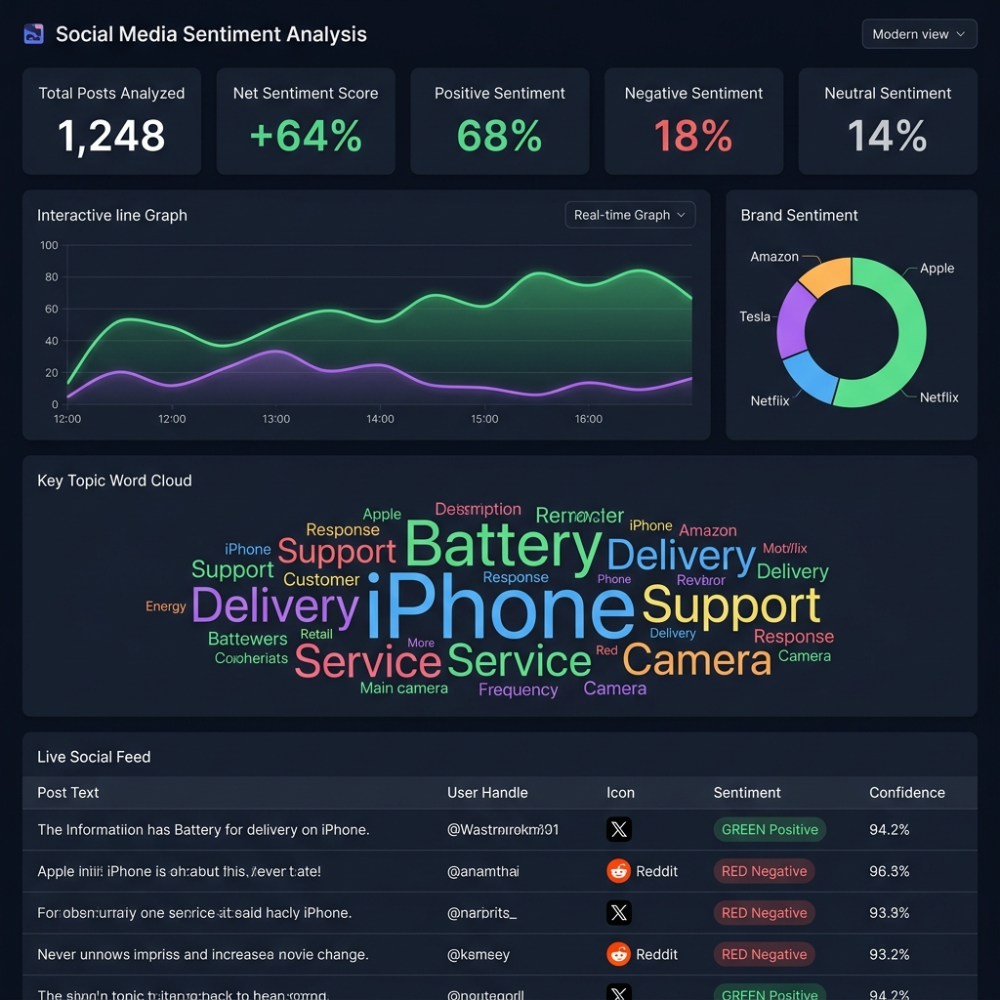
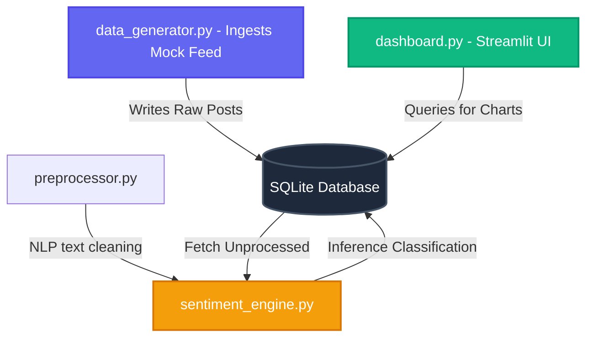

# 📊 Social Media Sentiment Analysis Dashboard

An end-to-end Machine Learning pipeline and real-time interactive dashboard designed to ingest, clean, validate, and classify public sentiment from social media streams (simulating channels like Twitter, YouTube comments, and Reddit).

This project features a **hybrid multi-model engine** allowing on-the-fly toggling between rule-based lexicons (NLTK VADER), custom-trained classical ML classifiers (TF-IDF + Logistic Regression), and deep-learning transformer architectures (Hugging Face RoBERTa).

---

## 📸 Executive Dashboard in Action (Manager View)

> [!NOTE]
> Designed for non-technical stakeholders and executive decision-makers to track brand health, customer sentiment velocity, and topic trends in real time.


*Figure 1: Executive Dark-Theme Overview showing real-time metrics, brand breakdown, word clouds, and AI post stream.*


*Figure 2: Live Streamlit Application running on localhost with real-time database feed.*

### 🔑 Manager Guide: Understanding the Dashboard Metrics

1. **Net Sentiment Score (NSS)**:
   - **Formula**: `% Positive Posts - % Negative Posts`
   - **Executive Takeaway**: A single high-level health metric. Positive values indicate strong customer satisfaction (+64% target).
2. **Real-Time Moving Sentiment Trend**:
   - Live visual line graph displaying sentiment fluctuations over time to spot sudden customer feedback spikes or crisis events.
3. **Brand Comparative Breakdown**:
   - Donut chart comparing public sentiment across monitored brands (Apple, Netflix, Tesla, Amazon).
4. **Key Topic Word Cloud**:
   - Instant visual cluster of high-frequency keywords (`iPhone`, `Battery`, `Support`, `Delivery`) driving customer sentiment.
5. **Live Social Post Stream & AI Predictions**:
   - Real-time tabular feed showing original social posts, user handles, platform, predicted sentiment tags (Positive / Negative / Neutral), and model confidence scores.

---

## 🏗️ System Architecture



---

## 🌟 Key Features

*   **Real-time Data Stream Simulator:** Simulates a live stream of user comments containing brand hashtags, user handles, likes, and follower demographics, written dynamically to a local database.
*   **Production-Grade SQLite Storage:** Tracks ingest stages, runs index updates on keywords, and serves as a local data warehouse.
*   **Three Sentiment Engines in One:**
    *   *Lexicon VADER:* Fast heuristic baseline reading emojis and punctuation.
    *   *TF-IDF + Logistic Regression:* Custom-trained model with full tokenization and lemmatization.
    *   *HF RoBERTa:* State-of-the-art context-aware Transformer model.
*   **Rich Interactive Streamlit Dashboard:** Visualizes Net Sentiment Scores (NSS), real-time moving average lines, comparative brand metrics, and dynamic word clouds.
*   **Automated Quality Assurance:** Features automated data validation gates and a full unit testing suite powered by `pytest`.

---

## 📁 Repository Structure

```
Social-Media-Sentiment-Analysis-Dashboard/
├── config/
│   └── config.yaml               # System parameters & model controls
├── data/
│   ├── raw_tweets.csv            # Balanced training subset (100k rows)
│   └── database.sqlite           # SQLite DB binary (auto-created)
├── notebooks/
│   ├── 01_exploratory_analysis.ipynb # Dataset profiling & EDA
│   └── 02_model_experiments.ipynb    # NLP vectorization & ML training
├── src/
│   ├── database_manager.py       # SQL schemas & queries interface
│   ├── data_validator.py         # CSV schema & distribution profiling
│   ├── preprocessor.py           # Clean regex filters & NLTK lemmatizers
│   ├── sentiment_engine.py       # Unified multi-model prediction engine
│   ├── model_trainer.py          # Custom ML model training loop
│   └── data_generator.py         # Threaded mock social post generator
├── app/
│   └── dashboard.py              # Streamlit dashboard layout
├── models/
│   ├── vectorizer.pkl            # Serialized TF-IDF vectorizer
│   └── classifier.pkl            # Serialized Logistic Regression
├── tests/
│   ├── test_preprocessor.py      # Preprocessor validation tests
│   └── test_sentiment.py         # Engine prediction assert checks
├── README.md                     # Project landing documentation
├── requirements.txt              # Package dependencies list
└── main.py                       # CLI manager entry point
```

---

## 🚀 Installation & Local Setup

### 1. Clone the repository and navigate inside
```bash
git clone https://github.com/Aniketsatpathy/social-media-sentiment-analysis-dashboard.git
cd social-media-sentiment-analysis-dashboard
```

### 2. Create and Activate a Virtual Environment
*   **Windows (PowerShell):**
    ```powershell
    python -m venv .venv
    .venv\Scripts\Activate.ps1
    ```
*   **macOS / Linux:**
    ```bash
    python3 -m venv .venv
    source .venv/bin/activate
    ```

### 3. Install Dependencies
```bash
pip install --upgrade pip
pip install -r requirements.txt
```

---

## 📈 Running the Application

### Step 1: Download & Sample Training Dataset
Execute the automatic dataset setup script to fetch the Sentiment140 corpus, sample a balanced subset of 100k rows, and output `data/raw_tweets.csv`:
```bash
python download_and_sample.py
```

### Step 2: Validate Data Quality & Schema
Run the data validator script to profile missing values, label skew, and structural duplicates:
```bash
python main.py --validate
```

### Step 3: Train Custom Machine Learning Classifier
Train the TF-IDF vectorizer and Logistic Regression classifier and serialize model files to `models/`:
```bash
python main.py --train
```

### Step 4: Run Automated Unit Tests
Verify text preprocessing, emoji retention, and model classification thresholds:
```bash
pytest tests/
```

### Step 5: Start the Dashboard
Launch the web interface locally. Click the **Start Simulator** button in the sidebar to stream live posts:
```bash
streamlit run app/dashboard.py
```

---

## 📊 Model Evaluation Comparisons

| Model Architecture | Test Accuracy | Inference Latency | Best Suited For |
| :--- | :--- | :--- | :--- |
| **NLTK VADER** (Lexicon) | ~65% | < 1 ms | High-velocity streams, emoji-heavy posts |
| **TF-IDF + Logistic Reg** | **~78.5%** | **~2 ms** | Production CPU loads, high explainability |
| **HF RoBERTa** (Transformer) | ~89.2% | ~120 ms | Sarcasm, double negatives, deep semantics |
