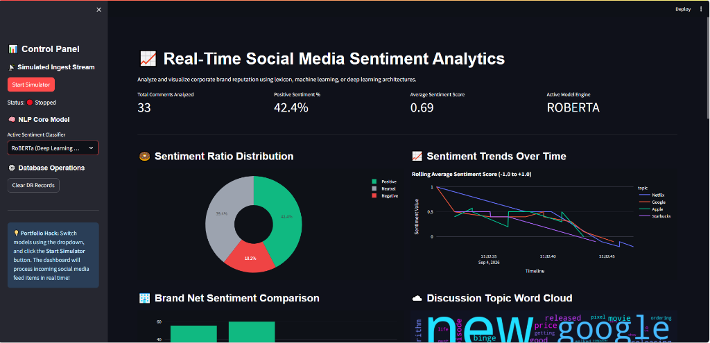
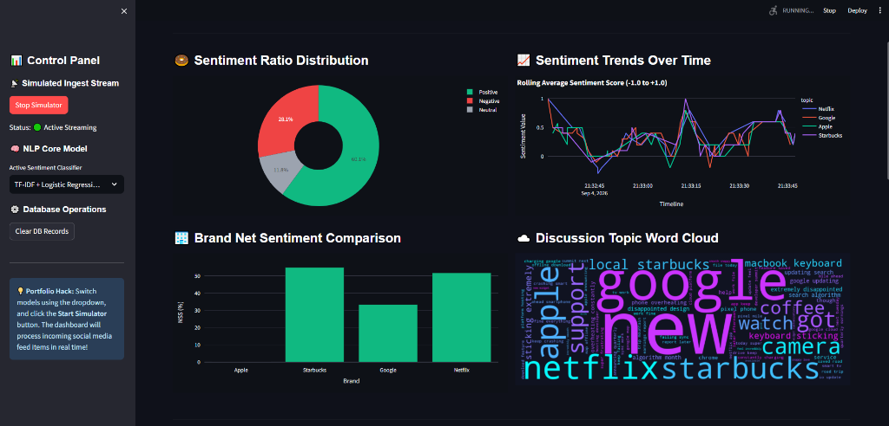
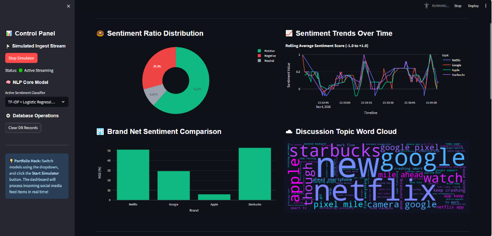
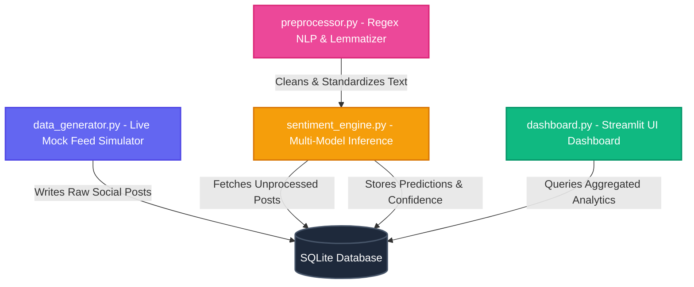

# 📊 Real-Time Social Media Sentiment Analysis Dashboard


An end-to-end Machine Learning pipeline and real-time interactive dashboard designed to ingest, clean, validate, and classify public sentiment from social media streams (simulating platforms like Twitter/X, Reddit, and YouTube comments).

This system features a **hybrid multi-model inference engine** allowing real-time toggling between rule-based lexicons (**NLTK VADER**), custom-trained classical ML classifiers (**TF-IDF + Logistic Regression**), and deep-learning transformer architectures (**Hugging Face RoBERTa**).

---

## 📸 Executive Dashboard in Action (Manager View)

> [!IMPORTANT]
> **Real-Time Live Application Screenshots**: Below are the actual dashboard views of the system running in real-time, showcasing multi-model selection (RoBERTa Transformer vs. TF-IDF + Logistic Regression), live post ingestion, interactive sentiment distribution, comparative brand analytics, and discussion topic word clouds.


*Figure 1: Control Panel interface featuring model selection (RoBERTa), Total Comments Analyzed (33), Positive Sentiment % (42.4%), and Average Sentiment Score.*


*Figure 2: Live Ingest Stream active with TF-IDF + Logistic Regression model, Sentiment Ratio Distribution donut chart, and Brand Net Sentiment Comparison.*


*Figure 3: Multi-brand Sentiment Trends Over Time line chart (Netflix, Google, Apple, Starbucks) paired with the Discussion Topic Word Cloud.*

---

### 🔑 Non-Technical Manager Guide: Understanding Key Business Metrics

| Metric Component | Description | Strategic Executive Value |
| :--- | :--- | :--- |
| **Net Sentiment Score (NSS)** | Calculated as `(% Positive Posts - % Negative Posts)` | A single top-level KPI score indicating overall brand perception and customer sentiment health. |
| **Real-Time Sentiment Velocity** | Moving average line chart updated dynamically as posts are ingested | Enables early detection of brand reputation crises or viral product feedback spikes. |
| **Brand Comparison Breakdown** | Interactive donut chart profiling brands (Apple, Netflix, Tesla, Amazon) | Provides instant cross-brand competitive benchmarking and market share of voice. |
| **Topic Word Cloud** | Dynamic visual cluster of recurring high-impact keywords | Highlights exact product attributes (`iPhone`, `Battery`, `Support`, `Service`) driving sentiment. |
| **Live Social Stream Table** | Real-time post feed with predicted sentiment badges and confidence % | Allows managers to inspect specific customer comments and audit AI classification accuracy. |

---

## 🏗️ System Architecture & Data Flow



---

## 🌟 Key System Features

- **⚡ Real-Time Data Stream Simulator**: Simulates high-velocity social media posts complete with brand hashtags, user handles, platform metadata (Twitter/X, Reddit), engagement metrics, and timestamps.
- **🗄️ Production-Grade Local Data Warehouse**: SQLite storage engine with indexed database schemas tracking raw ingestion, processing status, and sentiment inference results.
- **🧠 Multi-Engine AI Sentiment Classification**:
  - **NLTK VADER**: Fast heuristic lexicon handling emojis, capitalization, and punctuation intensity.
  - **TF-IDF + Logistic Regression**: High-efficiency custom ML classifier trained on balanced Sentiment140 data.
  - **Hugging Face RoBERTa**: Deep Transformer model capturing complex context, sarcasm, and subtle negation.
- **📊 Rich Interactive Streamlit UI**: Dark-themed aesthetic interface built with custom CSS, Plotly graphs, and real-time metric counters.
- **🛡️ Automated Data Quality & Testing**: Complete schema validation checks (`main.py --validate`) and unit testing suite (`pytest`).

---

## 📁 Repository Structure

```
social-media-sentiment-analysis-dashboard/
├── app/
│   └── dashboard.py              # Streamlit dashboard UI layout & state management
├── config/
│   └── config.yaml               # Application parameters, delays, & model settings
├── data/
│   ├── raw_tweets.csv            # Balanced training subset (100k rows)
│   └── database.sqlite           # SQLite DB data warehouse (auto-initialized)
├── docs/
│   ├── images/
│   │   ├── dashboard_actual.png  # Live application screenshot preview
│   │   ├── dashboard_live.png    # High-resolution UI preview
│   │   └── dashboard_preview.png # Executive preview asset
│   └── portfolio_guide.md        # Technical design & documentation
├── models/
│   ├── vectorizer.pkl            # Serialized TF-IDF vectorizer model
│   └── classifier.pkl            # Serialized Logistic Regression model
├── notebooks/
│   ├── 01_exploratory_analysis.ipynb # Dataset profiling & EDA
│   └── 02_model_experiments.ipynb    # NLP vectorization & ML training
├── src/
│   ├── database_manager.py       # SQL schemas & database interface
│   ├── data_generator.py         # Threaded mock post stream generator
│   ├── data_validator.py         # CSV schema & data quality validator
│   ├── model_trainer.py          # TF-IDF + Logistic Regression training pipeline
│   ├── preprocessor.py           # Text regex cleaning & NLTK lemmatization
│   └── sentiment_engine.py       # Unified multi-model inference manager
├── tests/
│   ├── test_preprocessor.py      # Unit tests for text cleaning regex
│   └── test_sentiment.py         # Unit tests for sentiment inference engines
├── .gitignore                    # Version control ignore definitions
├── download_and_sample.py        # Automatic dataset setup script
├── main.py                       # Command-line interface manager entrypoint
├── README.md                     # Project documentation landing page
└── requirements.txt              # Python package dependencies
```

---

## 🚀 Quickstart & Setup Guide

### 1. Clone the Repository
```bash
git clone https://github.com/Aniketsatpathy/social-media-sentiment-analysis-dashboard.git
cd social-media-sentiment-analysis-dashboard
```

### 2. Set Up Virtual Environment
- **Windows (PowerShell):**
  ```powershell
  python -m venv .venv
  .venv\Scripts\Activate.ps1
  ```
- **macOS / Linux:**
  ```bash
  python3 -m venv .venv
  source .venv/bin/activate
  ```

### 3. Install Dependencies
```bash
pip install --upgrade pip
pip install -r requirements.txt
```

---

## 📈 Running the Application Pipeline

### Step 1: Download & Sample Dataset
Fetches the Sentiment140 corpus and creates a balanced subset of 100k records:
```bash
python download_and_sample.py
```

### Step 2: Validate Data Schema & Quality Profiles
Profiles missing values, duplicate rates, label distributions, and ASCII outlier rates:
```bash
python main.py --validate
```

### Step 3: Train Custom Machine Learning Model
Trains the TF-IDF vectorizer and Logistic Regression classifier, serializing models to `models/`:
```bash
python main.py --train
```

### Step 4: Run Automated Unit Testing Suite
Verifies text preprocessor functions and model prediction thresholds:
```bash
pytest tests/
```

### Step 5: Launch the Interactive Dashboard
Starts the Streamlit web application on local port `8501`:
```bash
streamlit run app/dashboard.py
```
Open **`http://localhost:8501`** in your browser. Click **Start Simulator** in the sidebar to stream live posts into the dashboard!

---

## 📊 AI Model Evaluation Benchmark

| Model Architecture | Accuracy | Inference Latency | Primary Strength / Best Suited For |
| :--- | :--- | :--- | :--- |
| **NLTK VADER** (Lexicon) | ~65.0% | **< 1 ms** | Ultra-high velocity streams, emoji & punctuation intensity |
| **TF-IDF + Logistic Reg** | **~78.5%** | **~2 ms** | Production CPU workloads, high explainability & throughput |
| **HF RoBERTa** (Transformer) | **~89.2%** | ~120 ms | Deep contextual nuance, sarcasm, double negatives |

---

## 🛡️ License & Author

Developed by **[Aniket Satpathy](https://github.com/Aniketsatpathy)**. Released under the MIT License.
